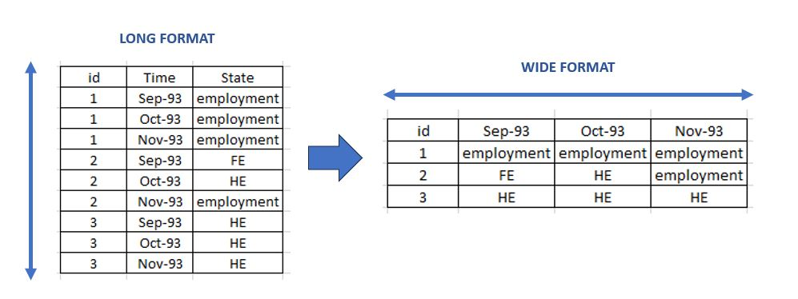
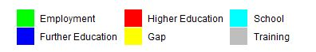
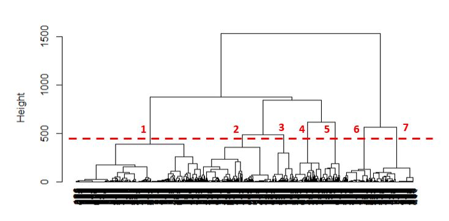

```{r setup, include=FALSE}
## rmarkdown chunks' setup
knitr::opts_chunk$set(echo = TRUE, ## show the code chunks in the report
                      message = FALSE, ## do not show the R messages in the report
                      warning = FALSE ## do not show the R warnings in the report
                      )
```

**Content**

1.  Introduction to State Sequence Analysis

2.  R Libraries & input data

    2.1 Example dataset (`mvad`)

    2.2 Data wrangling

3.  Create a STate Sequence (STS) object

4.  Sequences' visualisation: representation plots

    4.1 Representation plots/1: Index plots

    4.2 Representation plots/2: Sorted index plots

    4.3 Representation plots/3: Frequency plots (and tables)

5.  Sequences' visualisation: summarisation plots

    5.1 Sequence distribution plots (chronograms)

    5.2 Entropy curves

    5.3 Transition rate matrix

6.  Sankey diagrams

    6.1 DSS sequences

    6.2 Sankey diagrams

7.  Sequence clustering

# Introduction to State Sequence Analysis

-   We will look at some techniques that allow to visualise and analyse **temporal sequences of categorical data** ("**states**").

-   The techniques were originally created in computer science to detect dissimilarities between long strings of codes and then used computational biology to analyse DNA sequences.

-   They have then be adapted by the social sciences to visualise and analyse life trajectories (e.g. work, family, residential)

-   Within healthcare, they can be adapted to model, for example, longitudinal care pathways for patients or career trajectories of healthcare workers

# R Libraries & input data

-   [`TraMineR`](http://traminer.unige.ch/): a package for mining ("life Trajectory Miner for R"), describing and visualising sequences of states or events, and more generally discrete sequence data.
-   [`ggseqplot`](https://maraab23.github.io/ggseqplot/): it contains functions that reproduce the sequence plots from `TraMineR` using `ggplot2`.

```{r}
library(dplyr) ## data wrangling
library(ggplot2) ## general plotting
library(gt) ## format tables

library(TraMineR) ## event sequence analysis
library(ggseqplot) ## event sequence analysis ggplots
library(networkD3) ## for Sankey diagrams
library(cluster) ## for hierarchical clustering
library(WeightedCluster) ## compare clustering solutions
```

## Example dataset (`mvad`)

We will look at data of transitions school-to-work in Northern Ireland.

-   Cohort survey of 712 students from Northern Ireland.
-   Followed from September 1993 to June 1999 (70 months), after the end of high school. The time sequence includes the monthly occupation state for each student
-   Six possible "occupation" states: "Employment", "Further Education" (FE), "Higher Education" (HE), "Gap", "School", "Training"

This is an extract of the first 10 individuals in the dataset for the first 5 months available:

```{r}
data(mvad)

mock_data <-
  mvad |>
  select(-c(weight,catholic,Belfast,N.Eastern,Southern,S.Eastern,Western,Grammar,fmpr,livboth, funemp, Jul.93, Aug.93, male)) |>
  rename(
    GCSE_results = gcse5eq) |>
  mutate(
    GCSE_results = if_else(GCSE_results=="yes", "Higher score", "Lower score")
    )

head(mock_data[,c(1:7)], 11) 
```

Background characteristic (at survey time):

-   Binary GCSE score (column `GCSE_results`), measuring how well each student has done in their final GCSE exam (Lower/Higher score)

## Data wrangling

-   For this example, the data is organised in **"wide" format** (one row per individual) and ready to be used with `TraMineR` library
-   However, it is often the case that the raw data is available in **long/spell format** (multiple rows per individual) and needs to be wrangled to wide format.

{fig-align="centre"}

-   The [`TraMineR::seqformat()`](http://traminer.unige.ch/doc/seqformat.html) function allows to convert data from long/spell format into wide format

# Create a STate Sequence (STS) object

In order to process the sequence data (in wide format) using `TraMineR`, we need to transform it into a **STate Sequence (STS) object**, which includes:

-   A **matrix** storing all the **state sequences** from the data
-   A series of **attributes** to encode for:
    -   The **alphabet** of all possible states (e.g. the 6 possible occupation states)
    -   **Labels** associated to the alphabet states (for tables and plots)
    -   **Colours** of state legends

We first define the **STS object's attributes**:

```{r}
STS_object_attributes<-
  data.frame(
    short_label = c("EM", "FE", "HE", "GA", "SC", "TR"),
    long_label = c("Employment", "Further Education", 
               "Higher Education", "Gap", 
               "School", "Training"),
    colour = c("green","blue", "red", 
               "yellow","cyan", "grey")
  )

STS_object_attributes
```

Then we use `TraMineR::seqdef` to create the STS object (an automatic output message should be returned that confirms it has converte the data correctly: you cab check the alphabet/labels, the sample size/number of sequences and the number of expected time points or max/min seq):

```{r message=TRUE}
STS_object <-
  TraMineR::seqdef(
    ## sequences' data in wide format
    data = mock_data, 
    
    ## list of columns containing sequences
    var = 3:72,
    
    ## state labels used in plots
    labels = STS_object_attributes$long_label,
    
    ## state alphabet labels
    states = STS_object_attributes$short_label
  )
```

We can now set up the colout palette using `TraMineR::cpal`:

```{r}
## set colour palette for each state category
TraMineR::cpal(seqdata = STS_object) <- STS_object_attributes$colour
```

{fig-align="centre"}

This is how the first 4 sequences of the STS object appear (it is a list of sequences):

```{r}
head(STS_object, 4)
```

We can have a more compact view using this command: **complete** SPS (State Permanent Sequence) format

```{r}
print(head(STS_object, 4), format = "SPS")
```

# Sequences' visualisation: representation plots

They display **actually observed sequences**.

## Representation plots/1: Index plots

```{r fig.height=4,fig.width=6}
index_plot <-
  ggseqplot::ggseqiplot(
    seqdata = STS_object
    )

index_plot +
  labs(title = "Sequence index plot")
```

-   All observed sequences are displayed
-   First glance at the data, although the result can be a bit messy...

## Representation plots/2: Sorted index plots

To facilitate visual identification of patterns, the set of sequences can be sorted according to some specified criterion

```{r fig.height=4,fig.width=6}
## calculate pairwise dissimilarities 
## from a reference sequence
dist.mostfreq <- 
  TraMineR::seqdist(
    seqdata = STS_object, ## the sequence object
    
    refseq = 0, ## the most frequent sequence
    
    method = "LCS" ## Longest Common Subsequence
    ) 

index_plot_sorted <-
  ggseqplot::ggseqiplot(
    seqdata = STS_object, ## the sequence object
    sortv = dist.mostfreq  ## sorting vector
    )

index_plot_sorted +
  labs(title = "Sorted sequence index plot")
```

-   In this example the most common sequence was first identified as reference sequence (`refseq = 0`) and all other sequences were sorted according to their similarity to the reference (`dist.mostfreq`).

-   In the plot, the reference sequence is represented at the bottom.

-   An interesting pattern emerges: many individuals start in "School" (light blue) or "Further Education" (blue) and then progress into "Employment" (green) or "Higher Education" (red)

We can also visualise the same plot by **group**, adding it as a parameter. For example here we look at the same data by "GCSE results" and notice the difference in the most common sequences.

```{r}
ggseqplot::ggseqiplot(
  seqdata = STS_object, ## the sequence object
  sortv = dist.mostfreq,  ## sorting vector
  group = mock_data$GCSE_results  ## plots by group
    )
```

## Representation plots/3: Frequency plots (and tables)

We can also choose to represent only the **most frequent sequences** in the data and extract their frequency as well. For example, to visualise the top 10 most frequent sequences:

```{r fig.height=4,fig.width=6}
freqtop10_plot <-
  ggseqplot::ggseqfplot(
    seqdata = STS_object,
    ranks = 1:10,
    border = TRUE
  )

freqtop10_plot +
  labs(title = "Top 10 most frequent sequences")
```

A table with counts and percentages of the **most frequent sequences** can also be extracted:

```{r}
freq_table<-attr(
  x = 
    TraMineR::seqtab(
      seqdata = STS_object,
      idxs=0,
      ## specify SPS = State Permanent Sequence format
      format = "SPS"
      ),
  which = "freq") %>% 
    tibble::rownames_to_column(var = "Sequence")

head(freq_table, 10) |>  ## extract the top 10 most freq sequences
  gt() |>
  tab_options(table.font.size = 12)|>
  tab_header(md("**Top 10 most frequent sequences**"))
```

Again, we can look at the same plot by GCSE group. The most frequent sequence of events for those with "Higher score" is to start in "School" (light blue) at the beginning of their trajectories and then go into "Higher Education", while those with a "Lower Score" most commonly start directly into "Employment" (green) and remain there

```{r}
ggseqplot::ggseqfplot(
  seqdata = STS_object,
  ranks = 1:10,
  border = TRUE,
  group = mock_data$GCSE_results ## plots by group
  )
```

# Sequences' visualisation: summarisation plots

These plots provide an aggregated overview of the data (rather than representing directly individual trajectories).

## Sequence Distribution plots (Chronograms)

A **chronogram** is a series of stacked bar charts that visualise the **cross-sectional state distributions** of individuals (i.e. at each time point of the sequence). In other words, the plot shows the proportion of individuals/sequences in a specific state at each time point of the sequence.

```{r fig.height=4,fig.width=6}
chronogram <-
  ggseqplot::ggseqdplot(
    seqdata = STS_object,
    border = TRUE
  )

chronogram +
  labs(title = "Sequence distribution plot (Chronogram)")
```

## Entropy curves

The entropy curve shows the degree of **diversity** across state distributions at each time point of the sequence. Entropy values range from 0 to 1:

-   entropy = 0 --\> all individuals are in the same state
-   entropy = 1 --\> each state is associated to the same number of individuals

```{r fig.height=4,fig.width=6}
chronogram_with_entropy <-
  ggseqplot::ggseqdplot(
    seqdata = STS_object,
    border = TRUE,
    with.entropy = TRUE
  )

chronogram_with_entropy +
  labs(title = "Sequence distribution plot (Chronogram) 
       with Entropy")
```

Note how the cross-sectional entropy of the student cohort decreases at the end of the time sequence (as more and more individuals enter in the same state "Employment")

## Transition rate matrix

The following code allows to show the transition rates between states as a matrix.

-   The transition rates are first calculated using the function `TraMiner::seqtrate()`\
-   `ggseqplot` has its own function `ggseqtrplot()` to create the matrix, however I prefer aesthetically to build it directly with `ggplot2` (more customisation on colours, font sizes and labels)

```{r fig.height=4,fig.width=6}

STS_object_trates <- 
  seqtrate(STS_object) |> ## Calculate transition rates
  reshape2::melt() ## reshape data from wide to long format

## plot the heatmap
ggplot(STS_object_trates, aes(Var2, Var1)) +
  geom_tile(aes(fill = value), colour = "black") +
  geom_text(aes(label = round(value, 3), fontface = 2), colour = "red") +
  scale_fill_continuous(high = "#132B43", low = "#FFFFFF", name="Transition rates")+
  xlab("Transition to state")+
  ylab("Transition from state")+
  theme(axis.text=element_text(size=10),
        axis.title=element_text(size=14))
```

-   The Start State is represented vertically while the End State is represented horizontally
-   The higher the transition rates, the more intense the blue
-   The highest rates (in the diagonal, all \> 0.9) indicate that individuals in a particular state tend to remain in the same state
-   The next highest transition rate (0.042) is [GA] --\> [EM] (from Gap to Employment)

# Sankey diagrams

## DSS sequences

So far we have considered state sequences that include the length of time spent in each state. We can also look at sequences of transitions from one state into another, without considering the time. These are called **DSS (Discrete Successive State)** sequences and can be visualised using all the tools shown previously and also using Sankey diagrams.

These are the explicit **State sequences (STS)**:

```{r}
head(STS_object, 4)
```

They can also be written in "compact" **SPS** (**State Permanent Sequence**) format:

```{r}
print(head(STS_object, 4), format = "SPS")
```

These are the same sequences in **DSS (Discrete Successive State)** format, removing the information of time spent in each state. The DSS sequences can be extracted using `TraMineR::seqdss` function:

```{r}
## extract DSS frequencies

# extract sequence of distinct states 
DSS_sequences<-
  TraMineR::seqdss(
    seqdata = STS_object,
    
    ## to consider missing values as a valid "state"
    with.missing=TRUE 
    )

head(DSS_sequences, 4)
```

## Sankey diagrams

We can use a Sankey diagram to visualise the DSS sequences. Since plotting the whole dataset would look a bit messy, I will just focus on those students starting their trajectories from a "Further Education" state (FE)

```{r}
STS_object_FEstart <- 
  ## we can extract only those individuals who
  ## started their trajectories from "Further Education" state
  subset(STS_object,mock_data$`Sep.93` == "FE")

# extract sequence of distinct states 
DSS_sequences_FEstart<-
  TraMineR::seqdss(
    seqdata = STS_object_FEstart,
    
    ## to consider missing values as a valid "state"
    with.missing=TRUE 
    )

## create DSS_freqTable_FEstart
DSS_freq_table_FEstart<-
  attr(
    TraMineR::seqtab(
      seqdata = DSS_sequences_FEstart,
      idxs=0,
      format = "SPS"),
    which="freq") %>% 
  tibble::rownames_to_column(var = "Sequence") 


head(DSS_freq_table_FEstart  |>
  mutate(Sequence = gsub('/1', '', Sequence)), 10)
```

A **Sankey diagram** represents **flows** of individuals moving from one state to another. It uses **weighted connections** going from one **node** to another. Each node represents a state and the weighted connections correspond to the number of people moving between different states (the flows). I will use a custom made function created with the `networkD3` library.

```{r}
source("SankeyDiagram_function.R")

sankey_diagram <- 
  sankey_diagram_outputs(
  DSS_freqTable = DSS_freq_table_FEstart,
  
  ## assign the same colour palette previously used
  colour_palette_file = 
    STS_object_attributes |>
    select(short_label,colour) |>
    rename(Labels = short_label, Exadecimal.Codes = colour),
  
  plot_title = "Sankey diagram tutorial"
    
)

sankey_diagram$Sankey_plot
```

{fig-align="centre"}


-   On the plot, ST1 = State 1, ST2 = State 2 etc, going forward in the sequence of states.
-   At the beginning (State 1 = ST1), we can see there are, for example, 275 individuals who start their trajectories in the "Further Education" (FE/ST1 = blue) state. If you follow the connections, you can see that 154 of them flows into the "Employment" state (EM/ST2 = green), 38 into the "Higher Education" state (HE/ST2 = red), 51 into the "Gap" state (GA/ST2 = yellow), 25 into the "Training" state (TR/ST2 = grey), 6 into the "School" state (SC/ST2 = light blue), while 1 remains into the "Further Education" state (FE/ST2 = blue). And so on... 


# Sequence clustering

-   Clustering creates group objects (e.g. state sequences) in such a way that the **groups** obtained are **as internally homogeneous as possible** and **as different from one another as possible**.

-   The method discussed here is based on comparing state sequences and quantifying how dissimilar they are, by using a metric of **sequence dissimilarity**. 

-  Sequence dissimilarity can be computed with the **Optimal Matching (OM)** algorithm, which expresses distances between sequences in terms of amount of effort required to transform one sequence into the other one. **Three operations** are possible to transform one sequence into another:
    - **insertion** (one state is inserted into the first sequence to obtain the second)
    - **deletion** (one state is deleted from the first sequence to obtain the second)   
    - **substitution** (one state is replaced by another state)
  
- Each operation is associated to a cost. The **distance between two sequences** can be defined as the **minimum cost** to transform one sequence into the other. Definition of costs is often subjective, although it is possible to use **data driven methods** (e.g. **between-states transition rates** to define the substitution costs)


The following code uses `TraMineR::seqdist()` to compute the **pairwise sequence dissimilarity matrix** (e.g. distances between each pair of sequences) using OM. The pairwise distances for the first 4 sequences are shown:

```{r}
diss_matrix_OM <- 
  TraMineR::seqdist(
    seqdata = STS_object,
    
    ## Optimal Matching
    method = "OM", 
    
    ## Insertion/Deletion cost (subjective)
    indel = 1, 
    
    ## Substitution cost matrix 
    ## (TRATE = Transition Rates of States --> data-driven)
    sm = "TRATE") 

diss_matrix_OM[1:4,1:4]
```

-   We can now carry out clustering. Different methods are available and we will focus on **hierarchical clustering** since it does *not* require to specify in advance the number of clusters (e.g. compare to k-means)

-   We will use the **Ward algorithm**, a hierarchical clustering method that attempts to minimise the within-cluster variance.


The function `cluster::agnes` is used to compute hierarchical clustering ("agnes" = Agglomerative Nesting). The function's output can be visualised as a **dendrogram**, a diagram with a tree structures showing the grouping hierarchy of the sequences:

```{r}
## compute hierarchical clustering
cluster_ward <- 
  cluster::agnes(
    
    ## x is the dissimilarity matrix
    x = diss_matrix_OM, 
    diss = TRUE, 
    
    ## we choose the Ward algorithm
    method = "ward")

## plot the dendrogram
plot(
  as.dendrogram(cluster_ward), 
  type = "rectangle", 
  ylab = "Height")
```

**...but, how many clusters should we use?**  
-  There might be **knowledge domain-driven** reasons to expect a specific number of clusters
-  Otherwise, we can use **data-driven clustering quality metrics**, which give an indication on the optimal number of clusters for the specific dataset.

The following code will use the `WeightedCluster::as.clustrange` function to compare different clustering solutions (from 2 to 25 clusters). Multiple clustering quality metrics for each number of cluster considered. We will focus only on metrics:

  - **Point Bi-serial Correlation (PBC)**: to maximise
  - **Average Silhouette Width (ASW)**: to maximise
  - **Hubert’s C coefficient (HC)**: to minimise
  
```{r}
ward_test <- 
  WeightedCluster::as.clustrange(
    
    ## the hierarchical clustering output
    object = cluster_ward,
    
    ## the dissimilarity matrix 
    diss = diss_matrix_OM, 
    
    ## the maximum number of cluster we want to evaluate
    ncluster = 25)

names(ward_test$stats)
head(ward_test$stats[,c("PBC","ASW","HC")],10)
```
  
We will plot these metrics so it is easier to visually inspect them:

```{r}
plot(
  ward_test, 
  stat = c("PBC", "HC", "ASW"), 
  norm = "zscore", 
  lwd = 4, 
  xaxp =c(0,25,25))
```

Looking at both metrics simultaneously, 7 clusters seems a good compromise. We can use the `cutree` function to cut the clustering tree into 7 groups:

{fig-align="centre"}

The following code assigns each individual to one of the 7 clusters and add this new information to the original dataset. The new cluster variable can be used as a group variable to look at the sequences now. We can have a quick look at how many individuals belong to each cluster:

```{r}
## assigning each individual in the cohort to 
## one of the 7 extracted clusters
cluster_groups <- 
  factor(
    # cutree "cuts" the dendrogram into 7 groups
    x = cutree(cluster_ward,k = 7), 
    labels = paste("Cluster", 1:7)
    )

# add clusters' groups to the original dataset:
mock_data$cluster_group<-cluster_groups

# sample sizes by cluster group
mock_data |>
  group_by(cluster_group) |>
  summarise (
    `N individuals` = n()
  ) 

barplot(
  table(mock_data$cluster_group), 
  main="Clusters' distribution", 
  xlab="Cluster group", 
  ylab = "Number of individuals")
```

We can use all the plotting and analysis tools available in `TraMineR` to analyse the sequence data divided by cluster group. For example we can look at their chronograms to have an idea of how individuals in each cluster might differ in their trajectories:


```{r}
ggseqplot::ggseqdplot(
    seqdata = STS_object, 
    group = cluster_groups,
    border = FALSE
  )
```

Some interesting trajectory patterns emerge from each cluster group:
  
  - Cluster 1: individuals who enter the "Employment" state relatively early
  - Cluster 2: individuals who start in "Further Education" and mainly progress into "Higher Education"
  - Cluster 3: individuals who start in "Further Education" and mainly progress into "Employment"
  - Cluster 4: individuals who start in "Training" and mainly progress into "Employment"
  - Cluster 5: individuals who start in "School" and mainly progress into "Further Education" and "Employment"
  - Cluster 6: individuals who start in "School" and mainly progress into "Higher Education"
  - Cluster 7: individuals who end into "Gap" (Unemployment) state.
  
  
Finally, we can carry out some statistical analysis to identify whether there is any relevant association between clusters an other variables of interest. In this example we have a binary variable "GCSE results". We carry out a $\chi^2$ test to assess its statistical association with the clusters

```{r}
table(mock_data$cluster_group,mock_data$GCSE_results)
```

```{r}
mock_data |>
  group_by(cluster_group,GCSE_results) |>
  summarise(
    Counts = n()
  ) |>
  ungroup() |>
  ggplot(
    aes(x = cluster_group, y = Counts, fill = GCSE_results)
    ) +
  geom_bar(stat="identity", position = position_dodge())

```


```{r}
chisq.test(
  table(mock_data$cluster_group,
        as.factor(mock_data$GCSE_results))
  )
```

The test Post-hoc tests reveal a significant statistical difference between the two GCSE groups in Clusters 1 and 7 (more individuals with GCSE Lower scores), and Clusters 2 and 6 (more individuals with GCSE Higher scores)

```{r}
chisq.posthoc.test::chisq.posthoc.test(
  table(mock_data$cluster_group,
        as.factor(mock_data$GCSE_results))
  )
```


```{r}
ggseqplot::ggseqdplot(
    seqdata = STS_object, 
    group = cluster_groups,
    border = FALSE
  )
```


